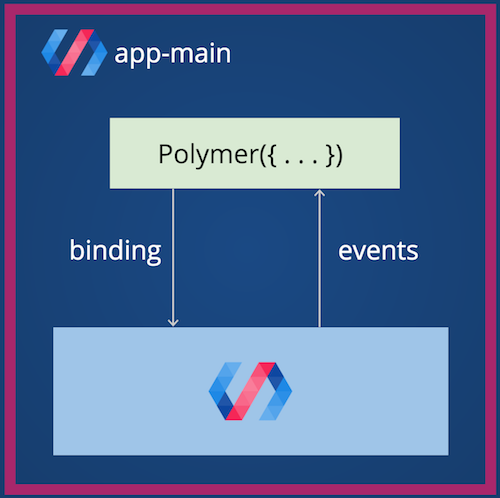

# Componentization

## Steps to a good componentization

* Each component should have an independent repository in order to be added as a dependency in the main project´s configuration files, such as the package or bower jsons .

* In order to build an independent and reusable component, the developer should abstract himself from the complete application and look for the concrete functionality that the component has to fill, and avoid the use of multiple dependencies.

* Take some time to understand how works the data flow in Polymer or Angular 2. Every component receives properties by data binding, using attributes on the component instantiation from the father. The communication between the children and their parents, should use native system events for a complete abstraction, such as Polymer Fire or Angular EventEmitter.
    
  This is very important, because using events for communication avoid the direct references between components.

* Search for complete and independent functional blocks. A unique button is not a good component, a button with a text field to validate/send/create a field is a good component. A unique component has to gave a concrete functionality to the developer, following the [Single Responsability Principle](https://en.wikipedia.org/wiki/Single_responsibility_principle). The granularity of the component has to be defined by the work team, in order to be as useful as possible. 

* The Web Components should be stateless elements, delegating this state management to a superior level in the components hierarchy. 

* Is important to add as much abstraction capabilities as we can, in order to make easier the personalization of the components and their evolution . For example, the developers should create one CSS3 custom variable for each property sensible to change, like border colors, text color or the standard padding of the component. 

* Don´t create a component for every part of your application. Just create a independent and reusable component when the element can be reused in other contexts or applications. The exceed of components is the worse problem that you can have working with an component-oriented architecture

* The Definition Of Done list of a component should be:
    - <strong>Reusable</strong>: The component is ready to be used if the developer imports it from node_modules / bower_components.
    - <strong>Independent</strong>: It has to be able to run without an external service or dependencies.
    - <strong>Tested</strong>: The component has to be tested and has at least 60% of coverage in his unit test.
    - <strong>Documented</strong>: The component has to be a complete documentation, generated with the current conventions, in order to be easy to be used by the developers, presenting inputs/properties, available methods and personalization style rules.

## Angular 2 

Working with Angular 2, you should export all needed modules in order to import them from the Angular main App. Working with the starter kit, the webpack configuration should be able to Tree Shake your files and takes only the necessary for the build.

 * Name your component file with . as type separator by functionality. header.component.ts. 
 * Define one component per file.
 * Do use upper camel case for class names.
 * Do use a custom prefix for a component selector. If the project is "Santander", you can use stn-header as component selector.
 * Do use upper camel case when naming classes.
 * Do declare variables with const if their values should not change during the application lifetime.
 * Do use lower camel case to name properties and methods.
 * Do name the file such that you instantly know what it contains and represents.
 * Do use dashed-case or kebab-case for naming the element selectors of components.
 * Do define components as elements via the selector.selector: 'stn-hero-button' should have class HeroButtonComponent  
 * Define as @Input every property to has be defined by the parent.
 * Do limit logic in a component to only that required for the view. All other logic should be delegated to services.
 * Do name events without the prefix on.
 * Do put presentation logic in the component class, and not in the template.
 * Do use attribute directives when you have presentation logic without a template.
 * Do implement the lifecycle hook interfaces.
 
You can read the full [Angular guidelines](https://angular.io/styleguide) for more reference.

Those rules should be validated with codelyzer and every component that no follows the rules should be rejected.

## Polymer

Working with Polymer, you should be sure of upload the HTML file with the necessary resources to be completely functional without precompiling with Babel, SaSS or whatever tool that you could be using with this library.

 * Follow the [polymer documentation guidelines](https://polymerelements.github.io/style-guide/) to document correctly the code.
 * Elements should contain a dash in their name (e.g <my-tabs> vs <tabs>), per the Custom Element specification.
 * Use @attribute, @property, @method, @event to document the API for your element.
 * Published attributes should be camel-cased where multiple words are in use.
 * Provide sensible default values as part of your API if values will be bound and displayed anywhere in your template. Default property values in attributes are null.
 * Event names should have a prefix strongly related to the name of the element in use (e.g drive-upload-success vs upload-succeeded).
 * A unique event name should be fired for unique actions in your element that will be of interest to the outside world.
 * Use declarative event handlers over JS based (e.g. don't write addEventListener in your element code).
 * Define constants outside of the Polymer() constructor, wrapped in an anonymous self-executing function.
 * Methods should be camel-cased where multiple verbs/words are in use
 * Where possible, use on-tap instead of on-click to benefit from additional help provided for touch screens
 * Use a namespace for a concrete project components, such as stn-header. Only use a prefix shorter than three characters.
 * Use boolean attributes for boolean values. Ex: <my-element selected> instead of <my-element selected="true">.
 * Include all dependencies your component needs as imports.
 * The component should use the [iron-component-page](https://elements.polymer-project.org/elements/iron-component-page) for document and show your component
 
Those rules should be validated and every component that no follows the rules should be rejected.
