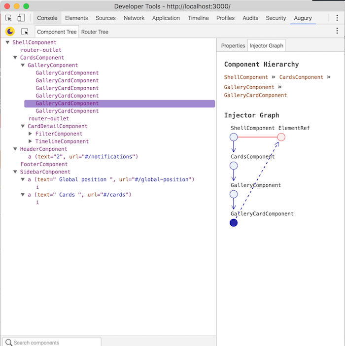

# Debug Tools

## Chrome Dev Tools

* Using the console is usefull and essential for debugging any web. You can execute defined functions, check values, modify the Dom and check how the app reacts to those changes. [Google guides for console debugging](https://developers.google.com/web/tools/chrome-devtools/console/)

* The remote debugging is very important when you are developing for mobile web applications. You can inspect devices connected to your computer going to [chrome://devices/](chrome://devices/). This is usefull to check the frame rate in applications or see load times with real devices and low connections. If you need to debug Apple devices, or need other tools, [weinre](https://people.apache.org/~pmuellr/weinre/docs/latest/Home.html) is an open-source Apache tool for rebote debugging. You can learn more about remote debuggin in Chrome [here](https://developers.google.com/web/tools/chrome-devtools/remote-debugging/) step by step

* In Google Chrome Inspector, you can set breakpoints along your code in order to check properties values, or application states before or after a concrete section of code. This is usefull to get information about a concrete error or a slow code execution. You can learn how to use them and good practices about them [here](https://developers.google.com/web/tools/chrome-devtools/javascript/step-code) and [here](https://developers.google.com/web/tools/chrome-devtools/javascript/add-breakpoints)

* The timeline tool, can be a little overwhelming in the first moment, but it throws a lot of useful information when it comes to web performance. It is essential to known what represents each section of this tool. Here we can see the frame rate of the animations, javascript execution times or the DOM parse and repainting of the browser. If you need more information about this [tool](https://developers.google.com/web/tools/chrome-devtools/evaluate-performance/timeline-tool)

* The full documentation about Chrome Dev Tools is available [here](https://developers.google.com/web/tools/chrome-devtools/) and its recommendable to read some topics about security, or other interesting points. Whenever you have a problem that is hard to debug, just go there and look for some tips.

## Debugging on Angular 2

### Using browser inspector

By default debugging is enabled in Angular 2 applications. Whenever you deploy your application in a production environment you should disable debugging information and switch into production mode. If you are using the [Serenity-Frontstack Starter Kit](https://github.com/serenity-frontstack/angular2-basic) this settings are visible on src/app/app.environment.ts
 
    if ('production' === ENV) {
        disableDebugTools();
        enableProdMode();
    }

On development mode, you can select the component element on the DOM and execute the following command in the console in order to show the component instance information.

    ng.probe($0).componentInstance

This comand is similar to the Angular 1 debug practice:
    
    angular.element($0).$scope

### Augury

[Augury](https://augury.angular.io/) is aGoogle Chrome Developer Tool extension for debugging and profiling Angular 2 applications.Augury helps Angular 2.0 developers visualize the application through component trees, and visual debugging tools. Developers get immediate insight into their application structure, change detection and performance characteristics.

Augury only works with applications in Development Mode. To learn more about this and how to use it, you can read the developer guide in their [official site](https://augury.angular.io/pages/guides/)

## Debugging on Polymer

[Polymer DevTools Extension](https://chrome.google.com/webstore/detail/polymer-devtools-extensio/mmpfaamodhhlbadloaibpocmcomledcg) is very usefull when the developer can´t see or understand the web components registration and life cycle events

In Google Chrome, you can select the selected element of the DOM with the $0 command. This allows the developer to access the properties of the selected component.