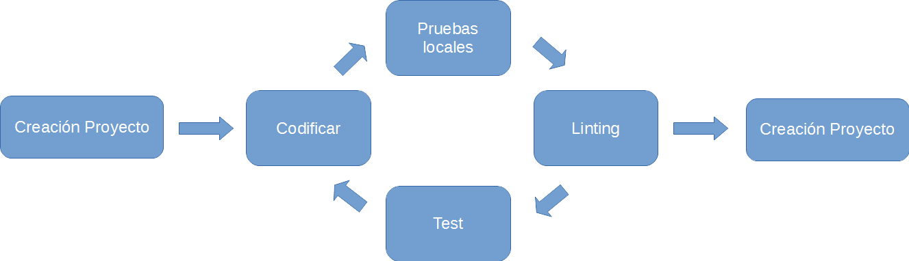

# IDEs for Angular 2.

In this document we are going to review the development environment needs for Angular 2. We will also review the most complete text editors and IDEs for Angular 2 development.

## Why an IDE?

We define an Integrated Development Environment (IDE) as a software development tool. An IDE usually consists of; A source code editor, autocompletion and code inspection tools, an application building tool and tools for debugging.

Until now the development of Web applications with JavaScript has been characterized by the use of lightness development tools, barely a text editor and a console.

But, with the complex development tools increasing, adding more tasks to the development process, testing and deploying applications, new programming languages ​​like TypeScript, making web application development have approached the life cycles and needs of other types of applications and languages ​​like Java or C#. Becasuse of that more sophisticated integrated environments are needed to simplify the whole process or life cycle of Web application development.

### IDE vs text editor?

An IDE goes beyond a simple text editor providing:

* An autocomplete and highlighted code by colors (intellisence) that takes the language elements and the context of the elements.
* Inspection of code at development time.
* Task automation tools, especially the building of application and testing within the IDE.
* Debugging tools built into the IDE.
* Good integration with version management tools; Git, cvs, mercurial, etc.

### Text editors converted to IDEs

Some of the most popular tools in web development did not start as IDEs, they are text editors which, by adding plugins or addins, give the functionality that you would ask for an IDE.
In order of the weight, the degree of functionality that they contribute and the popularity of them, we include them in this analysis.

## What minimum requirements should we ask for an IDE?

That it complies with the full life cycle of Web development to the highest possible degree:

### Angular 2 special needs.

Angular 2 is a framework that has the following particularities compared with a only JavaScript frameworks and libraries:

* Allows to be programmed in TypeScript and Dart. Strongly typed and well structured languages ​​that facilitate the creation of a good intellisence and a good control of errors while writing the code.
* Requires a complex building and packaging tasks.
* Allows to run on server. Which implies that it should be possible to be debugged from the IDE itself.

## List of Recommended IDEs:

* ALM
* Atom
* Brackets
* Eclipse
* Sublime Text
* Visual Studio Code
* WebStorm

### Table of IDEs, versions and platforms.

IDE | Contact Us | Platforms
--- | --- | ---
ALM | Open Source | Linux, Mac and Windows (Needs node and Chrome)
Atom | Open Source | Linux, Mac and Windows
Brackets | Open Source | Linux, Mac and Windows
Eclipse | Open Source | Linux, Mac and Windows
Sublime Text | Private | Linux, Mac and Windows
Visual Studio Code | Open Source | Linux, Mac and Windows
WebStorm | Private | Windows, Mac and Linux

#### Strengths and weaknesses

#### ALM

Web: http://alm.tools/

This editor presents some very interesting and innovative features. We boot it as an application server in a local port. To start the editor we have to call the URL (http://localhost:4444) from Chrome. This is very useful when we want to install as a service in a service provider so that we can always access to our environment from any computer anywhere.

Strengths | Weaknesses |
--- | --- |
Complete and preconfigured environment for TypeScript Easy installation with npm Ability to install in Cloud | Poor performance May be a bit complex at first No plugins supported |

#### Atom

Web: https://atom.io/

Strengths | Weaknesses |
--- | --- |
Very good code editor Easily extendable by plugins Lightweight | It's not an IDE, it is a text editor It's mandatory to install plugins to support TypeScript |

#### Brackets

Web: http://brackets.io/

Strengths | Weaknesses |
--- | --- |
Good support for code inspection and intellisense Lightweight Easily extendable by plugins | It's not an IDE, it's a text editor It's mandatory to install plugins to support TypeScript |

#### Eclipse

Web: http://www.eclipse.org/downloads/packages/eclipse-ide-javascript-web-developers/indigosr2
Some plugins: http://typecsdev.com/

Strengths | Weaknesses |
--- | --- |
One of the most powerful IDEs Easily extendable by plugins For someone coming from the Java's world is a familiar environment Plugins are very powerful and make it a very powerful IDE | Heavy and Slow It's mandatory to install plugins to support TypeScript |

#### Sublime Text

Web: https://www.sublimetext.com/

Strengths | Weaknesses |
--- | --- |
Lightweight Easily extensible by plugins | It's not an IDE, it's a text editor It's mandatory to install plugins to support TypeScript Requires License |

#### Visual Studio Code

Web: https://code.visualstudio.com/

Microsoft is also the creator of TypeScript

Strengths | Weaknesses |
--- | --- |
It's an IDE and has everything you could wait for an IDE Easily extendable by plugins Lightweight Integrated debugging, intellisense and code refractor | A little basic out of TypeScript Need to install some plugins to make it more productive You can not see two folders in the same window

#### WebStorm

Web: https://www.jetbrains.com/webstorm/

Strengths | Weaknesses |
--- | --- |
It is an IDE and has everything you could wait for an IDE Easily extendable by plugins Lightweight Integrated debugging, intellisense and code refractor | License required

#### Comparison table

Comparison parameters:

1. Development helps. Autocomplete, markup of the source code. Indication of errors.
2. Integrated tasks. Build, Linting, Watch, etc.
3. Debugging. Possibility of debugging code when dealing with code that is not executed in a browser (nodejs).
4. Performance. Consumption of equipment resources and speed of operation.

IDE | Development assistance | Integrated Tasks | Debugging | Performance
--- | --- | --- | --- | ---
ALM |  |  |  | 
Atom |  |  |  | 
Brackets |  |  |  | 
Eclipse |  |  |  | 
Sublime Text |  |  |  | 
Visual Studio Code |  |  |  | 
WebStorm |  |  |  | 

## Conclusions

Indeed all the tools considered are excellent choices as development tools and, beyond personal preferences, the most complete IDEs from scratch without the need to include plugins are; *WebStorm* and *Visual Studio Code*. Highlighting the first by functionality.

In another order are the editors that by plugins allow to obtain a degree of comfort and very good productivity. In this case they highlight *Brackets* (with a post in the Blog of John Papa indicating their personal configuration) because its good support of intellisense and *ALM* because the good built in tools and the possibility of installing it in Cloud.